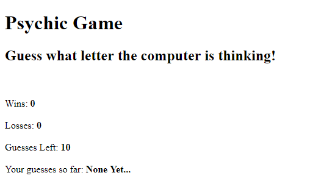

# Psychic-Game

This is an assignment done for UC Berkeley Coding Bootcamp. The goal for this assignment was to create a game in Javascript where the user has to guess what letter the computer has picked at random. This was an activity to explore and utilize interactivity with the Javascript language.

I utilized conditional statements to create the rules and looping functionality of the game, functions to create a "reset" state to restart the game, variables to track scores and arrays, and alerts to notify the user of significant events that occur during the game.

---
## Technologies Utilized:
* Git
* HTML
* Javascript

---
